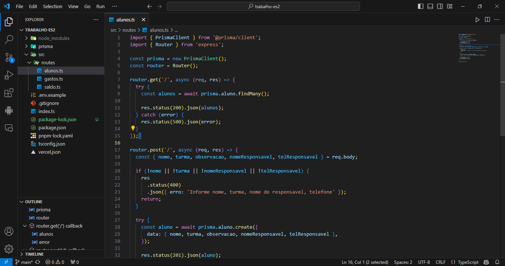
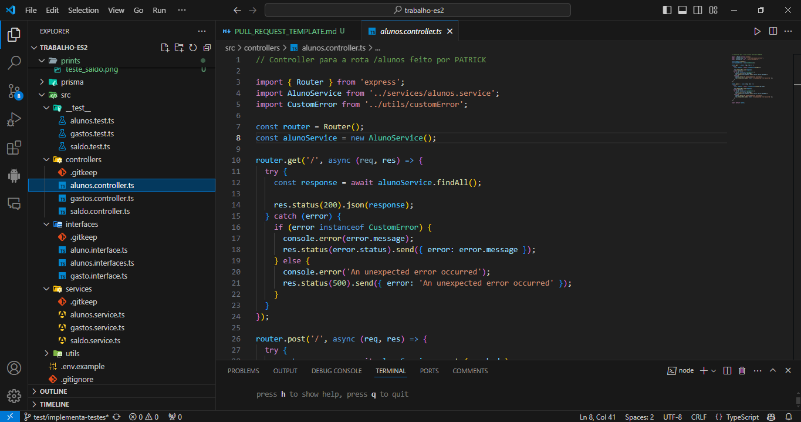
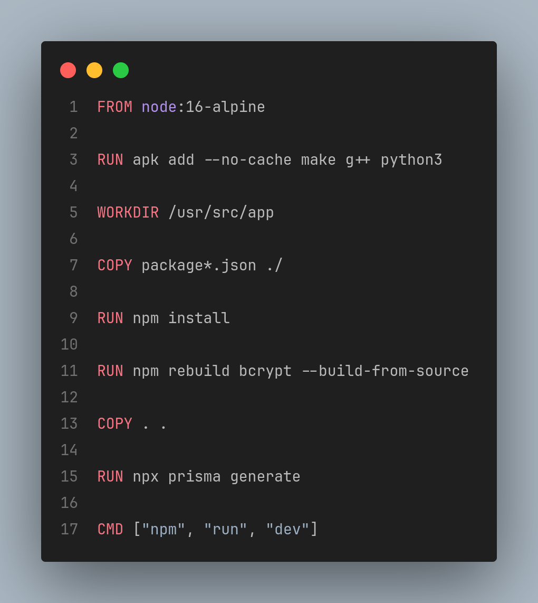
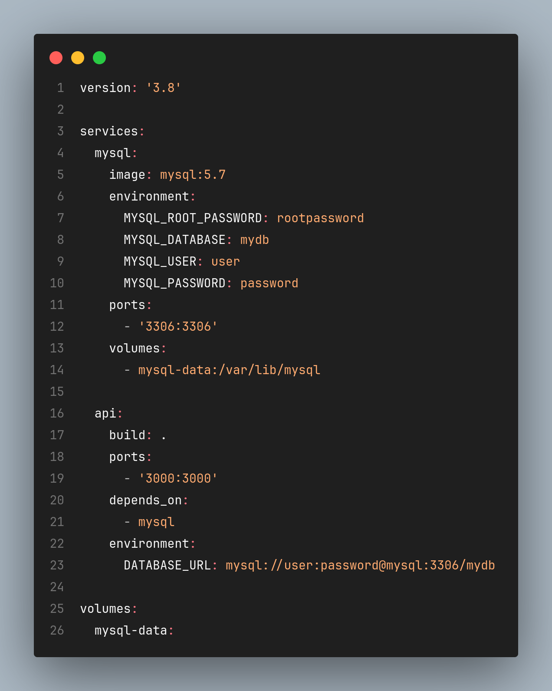
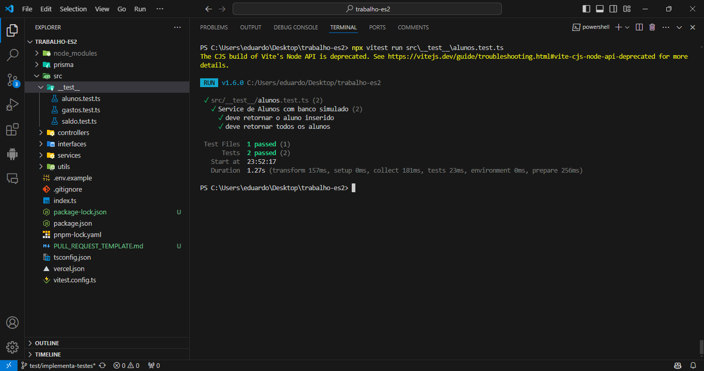
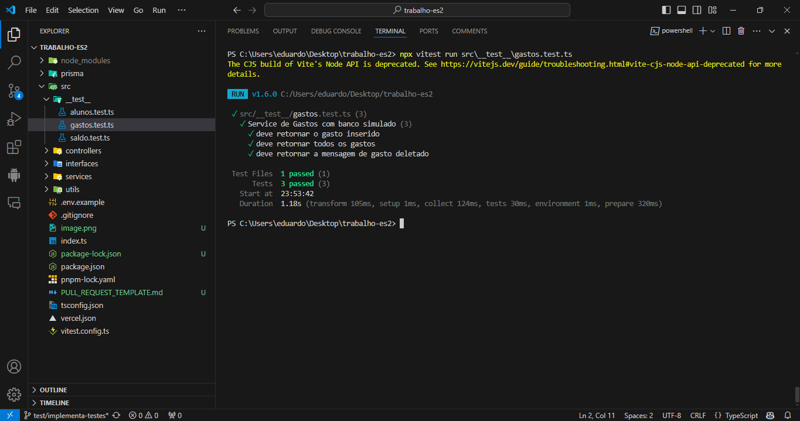
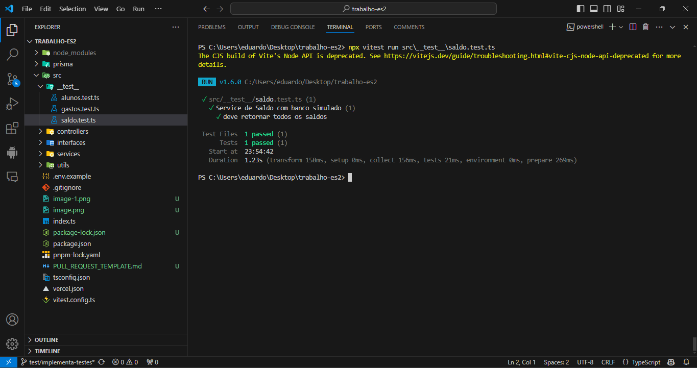

# Descrição do Pull Request

## O que foi alterado

- [] Refatoração do código para separação de responsabilidades entre o roteamento e o serviço.
- [] Implementação de serviços dedicados para lógica de negócios.
- [] Integração de tratamento de erros personalizados usando a classe `CustomError` para melhor gerenciamento de exceções.
- [] Criação de testes unitários utilizando o framework `vitest`.
- [] Criacao do docker para rodar banco de dados e API

## Prints dos Códigos

## Ferramenta de Testes Utilizada

Utilizamos o framework vitest para escrever e executar testes automatizados. Este framework permite simular comportamentos de funções e objetos, facilitando a escrita de testes unitários.

## Configuração e Instalação

- [ ] Clone o repositório:
    - Abra o terminal e execute o seguinte comando para clonar o repositório:
    - git clone https://github.com/seu-usuario/seu-repositorio.git
    - `cd seu-repositorio`
- [ ] Instale as dependências:
    - Certifique-se de ter o Node.js e o npm instalados. No diretório do seu projeto, execute o seguinte comando para instalar todas as dependências listadas no package.json:
    - `npm install`

- [ ] Executar testes:
    - Para executar os testes, você pode usar o script definido no package.json:
    - `npm test`

- [] Rodar docker:
    - `docker-compose up`

## Prints dos Testes Realizados

